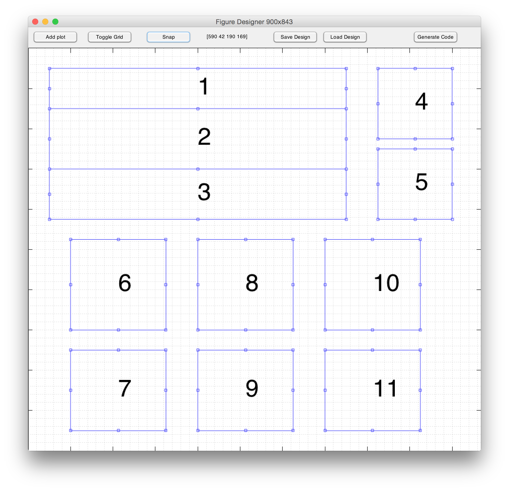
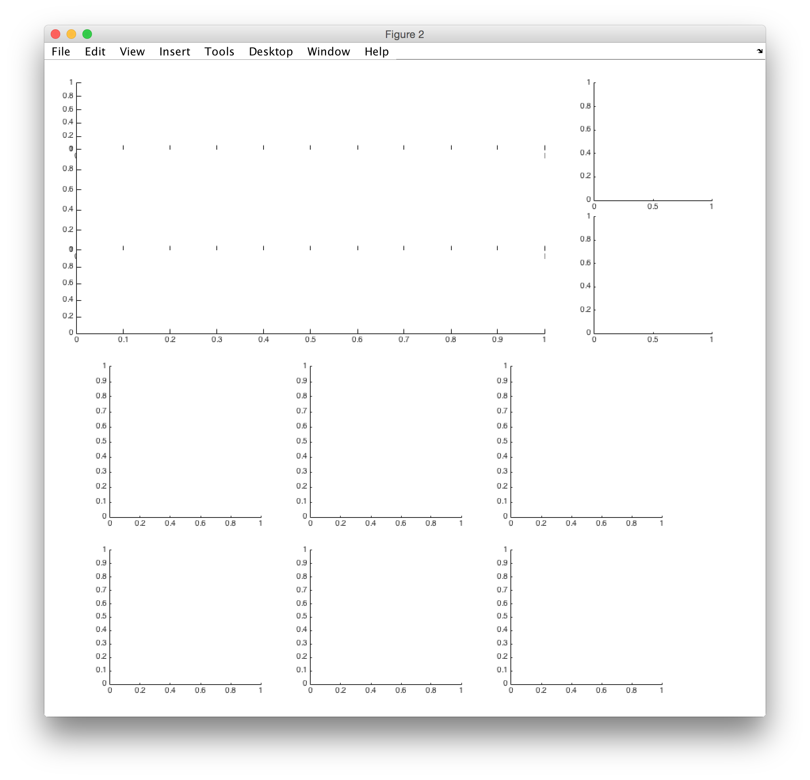

# DesignFig.m

interactively design figures with as many subplots as you want, arranged in whatever manner you want. Never use `subplot()` again. WYSIWYG. 

Designing this arrangement in `DesignFig:`

gives you this figure, ready to use:

`DesignFig` allows you to save designs for later edits, and generates the code to make the figure. 