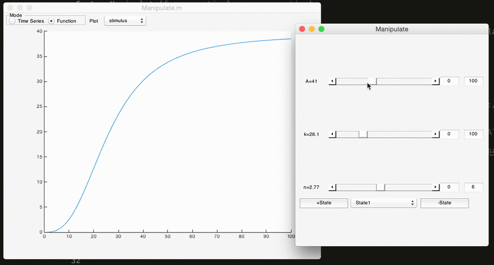

# Manipulate.m

## Function Manipulation 

Here, we can manipulate the [Hill](https://github.com/sg-s/srinivas.gs_mtools/blob/master/hill.m) function using:

```matlab
Manipulate('hill',[],[1:100]);
```


* The function is updated while we move the sliders around, not just when we drop it
* you can change the bounds easily to adjust how sensitive the sliders are
* Manipulate automatically read the function file and figured out what the parameters were. This magic is due to [getModelParameters.m](https://github.com/sg-s/srinivas.gs_mtools/blob/master/getModelParameters.m)

## Model manipulation 

## More sophisticated manipulation 

## Known bugs and limitations

1. Manipulate window does not close when manipulating external models. That's because the external model file doesn't know about the existence of Manipulate. 
3. Manipulate will not work with functions defined as [varargout] = foo(varargin);